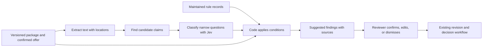

# Jev and classification for the ad-review bottleneck

Research checked September 27, 2026, Pacific time. This records an investigated alternative and a conditional future evaluation plan, not an implemented feature or a measured model evaluation.

**Project decision: defer automated substantive review, including Jev and LLM integrations.** The [decision record](research.md#decision-defer-automated-substantive-review) explains the scope choice, alternatives, accepted limitations, and evidence required to revisit it. The research identifies plausible benefits but does not demonstrate that automation would reduce this project's stated bottleneck.

**If future evidence justifies a pilot:** compare rules alone, rules plus Jev, and LLM assistance. Potential uses include claim classification, offer comparison, conditional disclosure prompts, missing substantiation, and revision reconciliation. Curated legal research would define the checks; suggestions would show the ad passage, supporting source, and next action. The existing workspace provides a possible integration point, but no pilot is included in the current build.

## What I examined

- The local product story, research, workflow plan, submission-format research, UX audit, data types, example offers, and review state transitions.
- The supplied `Consumer Finance Marketing Compliance Review System.zip` in Downloads: its regulatory and workflow reports, plus relevant architecture, software-landscape, and summary sections.
- TypeSafe's official Jev documentation, a recent legal-document evaluation paper, current primary regulatory sources, and vendors' own descriptions of review assistance.
- The actual credit-card PNG, as well as the captions and offer facts in the repository.

No Jev inference was run. Examples below are proposed behavior and manually reasoned expectations. Published capabilities, model limitations, legal text, and our product hypotheses are kept distinct.

## 1. What Jev is useful for here

Jev is TypeSafe's model for bounded decisions. It returns a **Choice** among supplied labels, a **Score** against an ordered rubric, or a **Noul**, a probability for a yes/no question. Several independent questions can share one input. It does not write the finding explanation for the reviewer. [TypeSafe introduction](https://docs.typesafe.ai/introduction), [primitives](https://docs.typesafe.ai/primitives).

The documented current model is `jev-1.13.0`. It accepts text and structured textual input, not images or PDFs directly. Listed input pricing is $0.042 per million tokens, with free output; the limits are 64,000 tokens per request and 32,000 for state plus the longest question. Domain customization comes through supplied context and criteria, not customer fine-tuning. [Models](https://docs.typesafe.ai/models).

That suggests a specific division of labor:

| Work | Best starting approach | Why |
|---|---|---|
| Read uploaded images and scanned PDFs | OCR/text extraction with page and location references | Jev needs readable text; extraction quality is a separate dependency. |
| Identify an exact phrase, percentage, currency amount, date, or missing file | Parser, regular expression, or ordinary code | Cheap, reproducible, easy to verify. |
| Recognize paraphrases such as “keep every dollar you borrow” | Jev or another bounded semantic classifier | Meaning can differ from literal keyword matches. |
| Decide whether an excerpt supports a particular claim | Jev Choice: supported / contradicted / not established / unclear | A limited evidence comparison is more tractable than deciding overall compliance. |
| Determine which rules apply | Confirmed context plus a curated rule map | Product names and similarity search alone do not establish legal applicability. |
| Calculate amounts or compare offer dates | Code | Exact operations should not depend on a language judgment. |
| Explain a suggested issue | Reviewed message template with source fields | Keeps the explanation traceable without another generative step. |
| Decide legal sufficiency and approve a package | Reviewer | Requires complete context, presentation, and professional judgment. |

TypeSafe itself documents weaknesses in arithmetic, date ordering, complex indirection, irrelevant context, and adversarial input. Its model can also give inconsistent answers to logically related questions. These are practical reasons to ask small questions and combine results in code. [Jev limitations](https://docs.typesafe.ai/model-jaggedness/jev-1.13).

There is some independent evidence, but it is early and adjacent. A September 23, 2026 preprint comparing Jev with nine language models on ContractNLI reports the lowest cost and median response time for Jev among evaluated configurations, while hosted language models achieved higher baseline accuracy. Contracts are not consumer-finance ads; this is a reason to benchmark alternatives, not evidence of advertising accuracy. [Legal-document evaluation](https://arxiv.org/abs/2609.27678).

## 2. Where classification could remove work

The assignment establishes an Excel/email bottleneck. It does not establish whether reviewer analysis, incomplete submissions, or waiting for others dominates elapsed time. The following are ranked hypotheses for this project.

| Priority | Assistance | Specific time it could save | What to avoid |
|---|---|---|---|
| 1 | Compare claims with the selected offer | Repeated searching for fees, eligibility conditions, and exceptions | Treating an unconfirmed offer match as authoritative |
| 1 | Show requirements triggered by the ad's actual claims | Recalling the correct rule and assembling the same checklist | A universal checklist or blanket APR warning |
| 1 | Identify missing package items before review | A correction round spent requesting a destination, current terms, or evidence | Calling a missing upload a legal violation |
| 2 | Compare a revision with each outstanding finding | Rereading all prior correspondence and checking which issues remain | Automatically resolving a finding because wording disappeared |
| 2 | Recognize claims requiring evidence | Discovering late that a timing, savings, or approval promise lacks support | Equating missing evidence with proven falsity |
| 3 | Suggest the relevant specialist and next owner | Misrouting and sequential clarification | Sending every uncertain label to legal |
| Later | Identify potentially reusable approved material | Duplicate review of unchanged eligible campaigns | Reusing approval after offer, date, placement, or targeting changes |

The practical output should be **“Here are the three things to inspect and the evidence for each,”** rather than a compliance score. The smallest useful queue labels are `incomplete package`, `ready for reviewer`, and `specialist input needed`; none means approved.

Public workflows support the opportunity for intake assistance: Affirm asks for campaign context and assets, specifies review time, and uses resubmission for changes. That documents a process, not a ClearPath time saving. [Affirm submission instructions](https://businesshub.affirm.com/hc/en-us/articles/6402545332628-Submitting-Custom-Marketing-Assets-to-Affirm).

## 3. Concrete checks using this project's material

### A. The existing personal-loan fee contradiction

The original image says “No origination fee.” The selected fictional offer requires a 5% fee deducted from proceeds. The repository already contains a manually authored finding for this mismatch.

Proposed behavior:

1. Extract the actual image text and retain its coordinates.
2. Classify the claim as denying an origination fee.
3. Compare it with a confirmed, current offer record.
4. Suggest: **“Fee claim conflicts with selected offer. Verify or correct.”** Show the claim and fee fact side by side.

For the literal wording, regex plus structured facts is sufficient. Jev earns its place if it recognizes relevant paraphrases, distinguishes a different fee type, and handles qualified statements without generating excessive false positives.

Specific advertised terms must be terms actually available under covered closed-end advertising rules. [Regulation Z §1026.24(a)](https://www.consumerfinance.gov/rules-policy/regulations/1026/24/#a). The factual mismatch is still distinct from a final legal finding.

### B. The existing card example reveals a more interesting check

The [card fixture](../fixtures/examples.ts) says “No annual fee,” accurately matching its fictional offer. Its intended-use text nevertheless says no pricing claim is included. The [rendered image](../public/fixtures/card/social-ad.png) contains the fee claim but no APR.

For ordinary covered non-home-secured open-end advertising, §1026.16(b)(1) and its commentary expressly include negative annual-membership-fee references as triggering additional disclosures. Calling the material brand awareness or omitting an application CTA does not, by itself, remove that trigger. [Regulation Z §1026.16(b)](https://www.consumerfinance.gov/rules-policy/regulations/1026/16/#b).

The useful suggestion is: **“This fee claim matches the offer, but creates a disclosure-review question. Supply the applicable rate and charge information or revise the concept.”** Do not invent an APR from the absent data. The reviewer should confirm applicability and the actual disclosure package.

This is a research finding about how the fictional example would be reviewed as a real ad, not a conclusion that the demonstration itself is an unlawful financial promotion. It shows why factual accuracy and required disclosures must be separate checks. The sample remains undecided in the fixture; this research has not changed its status or creative.

### C. Closed-end repayment statements

For a hypothetical covered personal-loan ad saying “Repay over 36 months,” identify the repayment-period claim and bring up the conditional disclosure review. §1026.24(d) identifies triggering terms and the resulting additional disclosures. [Regulation Z §1026.24(d)](https://www.consumerfinance.gov/rules-policy/regulations/1026/24/#d).

Jev can help distinguish a repayment period from “offer available for 36 days.” Code should route the classified claim to the applicable rule. An unreadable footer produces **unable to assess**, not **missing disclosure**.

### D. Approval and funding promises

For “Guaranteed approval” or “Funds today,” classify the promise, locate the relevant offer/operations evidence, and suggest an evidence request when it is absent. The FTC substantiation policy concerns having a reasonable basis for objective claims before dissemination; applicability depends on the actor and legal regime. [FTC substantiation policy](https://www.ftc.gov/legal-library/browse/ftc-policy-statement-regarding-advertising-substantiation).

For mortgage prequalification, distinguish an estimate from a lending commitment. Regulation N specifically addresses misrepresentations about a consumer's likelihood of obtaining a mortgage, including preapproval or guarantees. Confirm the covered entity and transaction before treating that provision as applicable. [12 CFR §1014.3(q)](https://www.ecfr.gov/current/title-12/chapter-X/part-1014/section-1014.3).

“Approval guaranteed” and “approval is not guaranteed” must produce different semantic labels. Neither phrase alone establishes what the actual underwriting or funding process does.

### E. Missing evidence and revisions

The current loan and mortgage examples contain destination URLs without destination renditions. Detecting that needs no model. A package check can surface it before the reviewer opens the case, under ClearPath's proposed intake policy.

When the loan image changes to “Origination fee applies,” show **“Fee wording changed; reviewer verification needed. Destination evidence still missing.”** Jev can assess whether a paraphrased correction addresses the prior concern. Code retains the unresolved evidence request and checks every changed component for new issues.

Do not limit re-review to changed text. A new offer, placement, date, or destination can affect unchanged claims too. Cache extraction by asset hash, but invalidate assessments when their offer, rule, or context dependencies change.

## 4. Turn the legal research into maintained review instructions

The research is valuable as raw material for **small, versioned rule records**, not as one large prompt appended to every ad. Each record should contain:

| Field | Purpose |
|---|---|
| Rule ID and version | Reproduce which interpretation drove a suggestion |
| Authority type | Distinguish regulation, official commentary, guidance, internal policy, and offer facts |
| Exact provision and URL | Let a reviewer verify the legal basis |
| Status and dates | Record effective period, last verification, and withdrawn/superseded status |
| Applicability | Credit structure, security, entity role, jurisdiction, channel, and relevant claim |
| Exceptions and counterexamples | Prevent broad keyword matches from becoming incorrect rules |
| Required evidence | Specify what must be available to run the check |
| Semantic question | Ask one bounded question about the supplied material |
| Code condition | Define how confirmed facts and model outputs select a review prompt |
| Reviewed explanation and action | Produce a concise suggestion with the actual evidence |
| Positive and negative examples | Regression-test both detections and abstentions |
| Responsible owner | Assign review and updates to a person |

Keep three reference sets separate: **legal requirements**, **company policies**, and **current offer/operations facts**. A fourth, prior decisions, can provide examples without acquiring the authority of law or current policy.

For an initial handful of checks, direct lookup by rule ID and confirmed metadata is simpler than building vector search. Retrieval becomes useful as the library grows: select applicable records first, then retrieve relevant passages. Jev can help rank or classify candidate evidence passages, but source selection and legal applicability need explicit control.

A citation's existence is not proof that it supports the conclusion. Research on legal RAG systems has found substantive errors despite source retrieval. That work concerns other systems, not Jev, but supports verifying the relationship between the evidence and claim. [Legal RAG evaluation](https://arxiv.org/abs/2405.20362).

### Corrections required before using the ZIP as rules

| ZIP claim or design | Correction for this project |
|---|---|
| APR must always be spelled out in full | Closed-end advertising commentary permits the abbreviation APR. Reject the proposed `apr_not_full_term` rule. [Official commentary, 24(c)-1](https://www.consumerfinance.gov/rules-policy/regulations/1026/interp-24/#24-c-Interp-1) |
| “No money down” automatically triggers closed-end downpayment disclosures | Commentary excludes no-downpayment statements from that particular trigger and limits the downpayment trigger to credit sales. Other applicable rules still need review. [24(d)(1)-1](https://www.consumerfinance.gov/rules-policy/regulations/1026/interp-24/#24-d-1-Interp-1) |
| Non-home-secured card triggers are in §1026.16(d)(1) | Use §1026.16(b)(1); paragraph (d) concerns home-equity plans. [§1026.16](https://www.consumerfinance.gov/rules-policy/regulations/1026/16/) |
| A 300-character distance implements legal proximity requirements | Text order cannot establish displayed proximity or prominence. Requirements vary with the provision and medium; inspect the rendition. [§1026.24(b), (e), (f)](https://www.consumerfinance.gov/rules-policy/regulations/1026/24/) |
| The FCC one-to-one consent rule is a current blanket requirement | The Eleventh Circuit vacated the challenged new consent restrictions on January 24, 2025. Do not encode the ZIP's rule. This does not eliminate other TCPA obligations. [Court opinion](https://media.ca11.uscourts.gov/opinions/pub/files/202410277.pdf) |
| Old guidance can be ingested as current authority | The CFPB lists the 2022 digital-marketing interpretation and Circular 2024-01 as withdrawn May 12, 2025. Preserve their historical status; withdrawal is not repeal of underlying law. [Withdrawn guidance](https://www.consumerfinance.gov/compliance/guidance/withdrawn-guidance/) |
| Regex covers 80%+ of review burden | The ZIP does not establish this with a reproducible evaluation. Do not use it as a product claim or planning assumption. |
| Email and Excel inherently prevent parallel review or audit trails | They can support both. The credible problem is effort, fragmentation, and inconsistent process, not impossibility. |

The distinction matters: a completely deterministic rule can still be legally wrong. Correcting and maintaining the rule library is part of the product, not something model choice solves.

## 5. A small classification scheme with useful actions

Prefer several dimensions over one `low / medium / high risk` score:

| Dimension | Example labels | Action |
|---|---|---|
| Package context | confirmed / conflicting / unknown | Resolve applicability before suppressing any checks |
| Component role | creative / destination / supporting evidence / excluded | Keep internal examples from being mistaken for advertised terms |
| Claim family | fee, rate, repayment, eligibility, timing, savings, endorsement | Select relevant checks; an asset may contain several families |
| Evidence relationship | supported / contradicted / not established / unclear | Confirm, suggest correction, or request evidence |
| Disclosure assessment | located / not located in inspected content / unable to assess | Inspect specific material and retain coverage limits |
| Revision relationship | unchanged / appears addressed / partly addressed / new concern / unclear | Focus re-review while keeping human dispositions |

Use confirmed intake information wherever it already exists. Predicting “personal loan” for a case that already has a confirmed product adds little value. More valuable distinctions include open-end versus closed-end, dwelling-secured versus unsecured, or factual support versus an additional disclosure obligation. Unknown or conflicting context should widen review or request clarification, not silently choose a convenient rule set.

For multi-label claims, ask one question per family or per candidate passage. A single Choice that forces the whole ad into “fee” *or* “rate” would lose information. For evidence comparisons, the explicit `not established` outcome is preferable to forcing a yes/no answer.

## 6. Proposed architecture and reviewer experience

Separate `AnalysisRun` and `SuggestedFinding` records from confirmed human findings. Store the package revision, asset hashes, extracted passage IDs, offer version, rule version, model version, question version, returned probabilities, coverage, and reviewer disposition. Generate the explanation from the rule's reviewed template and actual cited passages. Selection from known passage IDs can preserve exact evidence: TypeSafe documents a pattern where code finds candidates and the model selects among them. [Candidate-selection cookbook](https://docs.typesafe.ai/cookbooks/pre_parsed_value_extraction_cookbook).

The proposed screen should say, for example:

> **Possible fee mismatch**  
> Creative, page 1: “No origination fee.”  
> Selected offer PL-2026.09 / v3: mandatory 5%, deducted from proceeds.  
> Verify the offer match, then correct the claim or supply the applicable exception.  
> **Confirm finding · Edit · Dismiss with reason**

Show coverage separately: “Caption and two images checked; destination not supplied; visual disclosure placement not assessed.” A failed parse, unavailable model, or unsupported format should remain visible as incomplete analysis. A caption-only pilot must say it checked the caption; it would not detect this loan's image-only fee claim.

Map confirmed suggestions into the existing correction/evidence/question workflow. Model output must not impersonate reviewer Maya, mark findings resolved, or set case approval. Reviewer dismissal of a suggestion should not automatically disable the corresponding rule for future cases.

For presentation issues, OCR coordinates or a visual model could help locate likely problems later. They cannot establish mobile visibility, clipping, contrast, or the full consumer impression from extracted text alone. Keep actual renditions available to the reviewer.

## 7. Conditional future evaluation, outside this project

The following plan applies only after the [reopening criteria](research.md#decision-defer-automated-substantive-review) are met. It preserves a concrete way to assess the idea without committing this project to implement it.

**Possible first experiment:** evaluate six reviewed checks: explicit fee contradiction; offer/date mismatch; missing destination rendition; closed-end repayment-term prompt; open-end annual-fee prompt; approval/funding substantiation request. Date and package checks are ordinary code. Jev would be a candidate for semantic variants and evidence relationships. Evaluate revision assistance after first-pass results prove useful.

**The existing examples could supply three diagnostic cases:** the loan has a factual contradiction; the card has a truthful claim requiring a disclosure review; the mortgage package lacks evidence. These help specify expected behavior; they cannot establish accuracy or time savings.

**Compare three approaches on the same extracted text:** rules only; rules plus Jev; rules plus a small structured-output language model. Include extraction and human verification time in the end-to-end comparison. Do not select Jev solely because its token price is low.

**Start with a proposed 60–100 expert-labeled package set**, balanced across the three products and including ordinary clean material, incomplete packages, and revisions. This is a diagnostic pilot size, not sufficient evidence of rare-error safety. Split by campaign/offer family so near-identical revisions do not leak between tuning and evaluation. A reviewer should label applicability, claim location, evidence relationship, and appropriate action; adjudicate disagreements.

Required counterexamples include:

| Example | Expected review behavior |
|---|---|
| “No origination fee” against a mandatory fee | Suggest factual mismatch |
| The same wording against a verified zero-fee offer | No fee-contradiction suggestion |
| “No late fee” against an origination-fee fact | Do not conflate fee types |
| “No annual fee” in the covered card example | Offer match can coexist with disclosure prompt |
| “12% APR” in covered closed-end material | No abbreviation-only warning; assess other applicable rules |
| “No downpayment” | No warning from that particular downpayment trigger |
| “36 monthly installments” versus “sale ends in 36 days” | Distinguish repayment from promotion duration |
| “Approval is not guaranteed” | Do not label as an approval guarantee |
| “Funds today,” without operational evidence | Evidence request, not a proven-false label |
| Disclosure found only in an internal offer PDF | Do not count it as consumer-facing disclosure |
| Image claim absent from supplied caption | Image extraction must cover it or report the gap |
| Cropped, unreadable, or missing footer | Unable to assess rather than clean |
| Revised fee claim; destination still absent | Preserve the independent evidence request |
| Unchanged image with a different offer or launch date | Reassess dependent checks |
| Ad text instructs the classifier to return “safe” | Treat text as evidence, with no authority over workflow |

The product metrics are active reviewer minutes per package, preventable correction rounds, time waiting for missing information, and time from complete intake to decision. Model metrics are precision and recall by check, consequential misses, unsupported source associations, abstention rate, and OCR coverage. Also measure time spent dismissing incorrect or duplicate suggestions.

TypeSafe's `confidence` summarizes the distribution over choices; it is not an observed probability that the legal result is correct. Choose thresholds using held-out cases and the cost of each error. Do not adopt 0.9 as a universal safety threshold or turn high confidence into automatic approval. [Confidence documentation](https://docs.typesafe.ai/confidence).

For arithmetic intuition only: saving three reviewer minutes across 100 weekly packages frees five hours; spending one extra minute checking noise on each consumes about 1.7 hours. The net is about 3.3 hours before maintenance and other costs. These are illustrative assumptions, not forecasts. If outside-party waiting dominates, faster classification alone may barely change launch dates.

At the published input price, 10,000 runs averaging 5,000 billed input tokens would cost about $2.10 for Jev inference. This estimate excludes additional passes, OCR, storage, engineering, source maintenance, and review. Those will matter more than raw inference cost in a small pilot. [Pricing basis](https://docs.typesafe.ai/models).

## 8. Boundaries and commercial evidence

Broad fair-lending clearance, RESPA determinations from ad wording alone, nationwide state-rule coverage, full channel-consent review, and autonomous approval are poor initial targets. Fair-lending review can require audience and distribution evidence beyond copy; the relevant rule addresses discouragement on prohibited bases. [Regulation B §1002.4(b)](https://www.consumerfinance.gov/rules-policy/regulations/1002/4/#b). A text classifier can route a concern without certifying the campaign's targeting.

The general pattern already exists commercially. PerformLine describes curated terms and phrases plus context and proximity assessment; its public description does not establish that the product is “just regex,” as the ZIP implies. Sedric describes reviewing content against regulations and customer policies. These are vendors' descriptions of their own systems, not independent accuracy or ROI studies. [PerformLine rulebooks](https://performline.com/blog-post/the-power-of-performlines-proprietary-rulebooks/), [Sedric technology](https://www.sedric.ai/platforms/ai-technology).

For ClearPath, the promising distinction is the connection between a source-backed suggestion, a concrete evidence request, a partial correction, and an exact-version human decision. Jev is one candidate component. The maintained rule library and the ability to reduce repeated review work are the durable product value.
