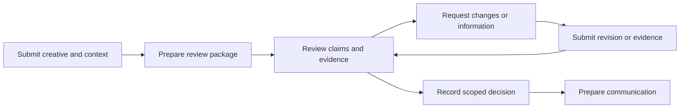

# Why this approval workspace

ClearPath Financial is fictional, but the assignment gives a concrete problem: marketing-compliance review across personal loans, credit cards, and mortgage prequalification is bottlenecked by Excel and email. It does not establish where time is lost. We researched the operating process before choosing features. The project discussion emphasized critical correctness, complete interactions, and deliberate omissions. The assignment allows 24 hours. The application now builds and passes API and browser workflow tests, including the review-record download; its temporary public demo is verified.

## Reconstructing the work

Our baseline is that **email carries submissions and revisions, Excel summarizes status, and people keep the two aligned**. The division of labor is an assumption about ClearPath, not an observed company workflow.

Published procedures make that assumption plausible. [Affirm asks partners](https://businesshub.affirm.com/hc/en-us/articles/6402545332628-Submitting-Custom-Marketing-Assets-to-Affirm) to submit creative and campaign context and return revisions through an email exchange. [GreenSky's guide](https://cms.greensky.com/docs/core/guidelines/marketing-compliance-guide.pdf#page=4) requires corrected material to return for final approval. [Coast2Coast's policy](https://coast2coastml-help.freshdesk.com/support/solutions/articles/158000458970-marketing-advertising-and-marketing-policy) connects approval to a particular version and use context. These are company procedures across different relationships, not universal legal requirements or evidence of review volumes.

A review package can contain an image, caption, and destination-page proof. It is neither one email nor necessarily one file. A pricing answer can add evidence without changing creative; a revised caption changes the package even when the image is unchanged.

## Who needs what

| Participant | Goal and responsibility |
|---|---|
| Marketer or affiliate | Submit usable material, understand feedback, and supply corrections. |
| Partner manager | Assemble context, coordinate outside the tool, and identify who owes the next action. |
| Compliance reviewer | Inspect claims and presentation, record findings, reconcile revisions, and own the decision. |
| Offer owner or specialist | Supply authoritative pricing, eligibility, or operational evidence when needed. |
| Manager | See ready and blocked work without reconstructing every case. |
| Consumer | Ultimately receive accurate, understandable marketing. |

These are responsibilities, not six required accounts. One person can perform several roles. Review ownership and the person who must act next remain distinct.

## The bottleneck hypothesis

The leading hypothesis is that reconstruction and incomplete correction rounds consume avoidable capacity: finding the current attachment, locating supporting facts, remembering unanswered questions, and updating a tracker. A partial revision illustrates the problem. The creator corrects a fee claim but leaves a funding promise unsupported. “Revised” does not mean ready for approval; the reviewer needs to retain the second issue and its owner.

We considered a compliance scanner, an approval workspace, and a governed template library. Each addresses a different source of delay: analysis effort, coordination effort, or repeat demand. The workspace most directly addresses the stated Excel/email problem. That is a reasoned choice, not a measured return on investment. Analysis-dominated queues or frequent reusable campaigns could change the ranking.

The product must still support substantive review. Findings connect a concern to the creative and its supporting evidence, distinguish corrections from evidence requests, and retain explicit dispositions through revisions. This provides more value than moving a “pending” row into a dashboard.

## Why automated review is outside this project

We investigated deterministic checks, Jev classification, LLM assistance, and retrieval over the supplied legal research. They could help identify claims, compare them with offer facts, find relevant requirements, and reconcile corrections. **The decision is to leave automated substantive review out of this project.** The [decision record](research.md#decision-defer-automated-substantive-review) compares these approaches; the [technical research](jev-ad-review-research.md) preserves the sources, examples, and conditions for a future evaluation.

The assignment gives us evidence of fragmented coordination, but no measurements showing that claim analysis is the dominant delay. A useful scanner would also need accurate extraction from the actual creative, maintained rules and exceptions, authoritative offer facts, and representative expert-labeled cases. Our research found errors in the supplied rule examples. Adding a model call would not establish that its findings are correct or that checking them saves reviewer time. Within the 24-hour assignment, that evaluation would compete with finishing and verifying the correction-to-decision workflow.

This choice accepts a cost: reviewers still identify issues and look up requirements themselves. The workspace supports that responsibility through original material, evidence requests, explicit dispositions, and versioned decisions. We have no evidence that ClearPath already has an adequate analysis tool, rejected AI, or is prohibited from using it. A future evaluation would first establish where time is lost and what tools, policies, and sources the team already uses. Automated assistance becomes a stronger candidate if it reduces total review effort without increasing consequential misses.

## Email outside, review inside

Expecting independent affiliates to adopt another portal is a risky assumption. The intended longer-term model preserves their email workflow while giving internal staff one review record. **V1 accepts direct submissions only.** A marketer submits directly, or a partner manager uploads the package received elsewhere. A separate submission page and case return link now let affiliates see deliberately shared feedback and return corrections. Reviewers can prepare editable drafts and publish a feedback or decision snapshot there; email is never sent by the app. Email import and live inbound/outbound integrations are deferred.

This boundary tests the review loop while leaving transfer effort visible. V1 cannot claim automatic capture, mailbox reconciliation, or email notification. Its value must exceed the work of entering submissions and transferring replies; maintaining Excel in parallel would undermine the intended benefit.

## What must be right—and what can wait

All three products share a human review workflow. Original PNG/JPEG and PDF material stays available alongside copy, context, and evidence. Other files remain available for manual download. Reviewers create findings and evidence requests themselves. Partial revisions preserve unchanged components, prior material, and unresolved concerns. Approval identifies the exact package version and context; it does not carry forward to changed material. Queue ownership and next actions are explicit. A reply marked **Prepared** is not **Sent**.

Domain research informed these choices without prescribing the software. For example, [Regulation Z §1026.24](https://www.consumerfinance.gov/rules-policy/regulations/1026/24/) contains conditional advertising and presentation requirements for covered closed-end credit. That supports preserving context and renditions, not claiming every advertisement needs the same checklist. V1 performs no automated legal checks, AI analysis, or OCR.

After verifying the core, we added a portable internal review-record export; it is not a production audit system. Email integration is the first V2 candidate. Narrow fee comparison, APR-location assistance, and repayment-disclosure lookup follow only if useful. Broad legal coverage, automatic approval, campaign publishing, and enterprise administration are excluded. The browser tests exercise real packages, unresolved issues through partial corrections, and durable, correctly scoped decisions. That demonstrates functionality; throughput improvement still requires measurement.

## What the audit changed

The first build put submission inside the reviewer dashboard. That did not fit the affiliate’s job, so we separated the full submission-and-correction journey. The audit also showed that findings hid their evidence, internal questions could become affiliate instructions, and saved drafts could not be edited. We spent the next iteration on those failures: adjacent evidence and editing, explicit audiences, frozen shared feedback, source versions, and recoverable drafts. [The short decision log](implementation-decisions.md) and [resolution table](audit-resolution.md) document the choices and limits.

The records are durable, but access control remains simulated: the reviewer dashboard is open and participant names are selectable. That cut supports an inspectable take-home demonstration, not a real-client pilot. Authentication, retention policy, and notification delivery would be necessary decisions before real use.
